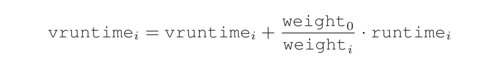
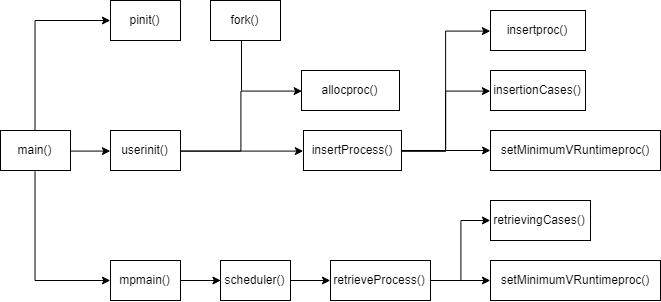

## 调度算法

参考文章：

1. 博客：

[几种进程调度算法总结](https://blog.csdn.net/ttyue_123/article/details/52166497)

[Inside the Linux 2.6 Completely Fair Scheduler](https://developer.ibm.com/tutorials/l-completely-fair-scheduler/)

[WIKI](https://en.wikipedia.org/wiki/Completely_Fair_Scheduler#Algorithm)

[github](https://github.com/shrivinayak/CFS-Scheduler)

2. 论文或书籍：

《three easy pieces》第九章  [Lottery Scheduling](http://pages.cs.wisc.edu/~remzi/OSTEP/cpu-sched-lottery.pdf)和[Multi-CPU Scheduling](http://pages.cs.wisc.edu/~remzi/OSTEP/cpu-sched-multi.pdf)

《[Understanding the Linux 2.6. 8.1 CPU scheduler](https://www-inst.eecs.berkeley.edu/~cs194-24/sp13/hand-outs/linuxKernelUnderstandingQueudet.pdf)》


CFS(完全公平调度算法)

1. vruntime，一个积累值，每次CFS会选择最小的vruntime运行。

2. sched_latency，CFS使用此值来确定在考虑切换之前一个进程应运行多长时间,需要除以进程数 （48 milliseconds）

3. min_granularity 最少花费时间（6 milliseconds) ，保证效率，否则会在频繁的上下文切换中耗费时间。

4. 权值

```c
 static const int prio_to_weight[40] = {
 / * -20 * / 88761, 71755, 56483, 46273, 36291,
 / * -15 * / 29154, 23254, 18705, 14949, 11916,
 / * -10 * / 9548, 7620, 6100, 4904, 3906,
 / * -5 * / 3121, 2501, 1991, 1586, 1277,
 / * 0 * / 1024, 820, 655, 526, 423,
 / * 5 * / 335, 272, 215, 172, 137,
 / * 10 * / 110, 87, 70, 56, 45,
 / * 15 * / 36, 29, 23, 18, 15,
 };
```



4. 为了保证效率，process(only running or runnable) 存在 red-black tree里

   > A
   > red-black tree is one of many types of balanced trees; in contrast to a simple binary tree (which can degenerate to list-like performance under worst-case insertion patterns), balanced trees do a little extra work to maintain low depths, and thus ensure that operations are logarithmic
   > (and not linear) in time.

5. 需要正确处理sleep过久的进程


红黑树的五个性质

> 1. 每个结点要么是红的要么是黑的。  
> 2. 根结点是黑的。  
> 3. 每个叶结点（叶结点即指树尾端NIL指针或NULL结点）都是黑的。  
> 4. 如果一个结点是红的，那么它的两个儿子都是黑的。  
> 5. 对于任意结点而言，其到叶结点树尾端NIL指针的每条路径都包含相同数目的黑结点


调用链：




代码详解：

```c
//proc.c
//Red-Black Tree data structure
struct redblackTree {
  // 节点数量
  int count;
  // 权重
  int rbTreeWeight;
  // 根节点
  struct proc *root;
  // 最小虚拟运行时间
  struct proc *min_vRuntime;
  
  struct spinlock lock;
  
  int period;
}rbTree; 
```

初始化运行队列 pinit()

```c
// proc.c
static struct redblackTree *runnableTasks = &rbTree;
// main.c
void
pinit(void)
{
  initlock(&ptable.lock, "ptable");
  // 初始化红黑树
  rbinit(runnableTasks, "runnableTasks");
}
// proc.c
/*
  rbinit(struct redblackTree*, char)
  parameters: pointer that contains the address of the red-black tree and a string containing the name of the lock
  returns: none
  This function will initialize the red black tree data structure.
*/
void
rbinit(struct redblackTree *tree, char *lockName)
{
  initlock(&tree->lock, lockName);
  tree->count = 0;
  tree->root = 0;
  tree->rbTreeWeight = 0;
  tree->min_vRuntime = 0;

  //Initially set time slice factor for all processes
  tree->period = latency;
}
```

userinit()->allocproc()

```c
static struct proc*
allocproc(void)
{
	.....
    // 初始化扩展的红黑树的属性
   p->virtualRuntime = 0;
   p->currentRuntime = 0;
   p->maximumExecutiontime = 0;
   p->niceValue = 0;

   p->left = 0;
   p->right = 0;
   p->parentP = 0;
}
```

->insertProcess()

```c
void
insertProcess(struct redblackTree* tree, struct proc* p){

  acquire(&tree->lock);
  if(!fullTree(tree)){	
	// 真正的插入进程到红黑树里
	tree->root = insertproc(tree->root, p);
	if(tree->count == 0)
		tree->root->parentP = 0;
    tree->count += 1;
	
	// 计算p的权重
	p->weightValue = calculateWeight(p->niceValue);

	// 红黑树的总权重
	tree->rbTreeWeight += p->weightValue;
	
    //检查红黑树属性违规的可能情况
	insertionCases(tree, p, 1);
		
	// 设置树的最小vruntime
	if(tree->min_vRuntime == 0 || tree->min_vRuntime->left != 0)
		tree->min_vRuntime = setMinimumVRuntimeproc(tree->root);
	 
  }	
  release(&tree->lock);
}
```

->insertproc()

```c
struct proc*
insertproc(struct proc* traversingProcess, struct proc* insertingProcess){
	
  insertingProcess->coloring = RED;
	
  // 如果树为空
  if(traversingProcess == 0){
	return insertingProcess;
  }		
  //如果插入的vruntime大于根节点的vruntime就插入右边，否则插入左边
  if(traversingProcess->virtualRuntime <= insertingProcess->virtualRuntime){
	insertingProcess->parentP = traversingProcess;
	traversingProcess->right = insertproc(traversingProcess->right, insertingProcess);
  } else {
	insertingProcess->parentP = traversingProcess;		
	traversingProcess->left = insertproc(traversingProcess->left, insertingProcess);
  }
	
  return traversingProcess;
}

```

->setMinimumVRuntimeproc()

```c
struct proc*
setMinimumVRuntimeproc(struct proc* traversingProcess){
  // 从最左下去直到NULL
  if(traversingProcess != 0){
	if(traversingProcess->left != 0){
	    return setMinimumVRuntimeproc(traversingProcess->left);
	} else {
	    return traversingProcess;
	}
  }
	return 0;
}
```

userinit()的进程相关调用链到此就结束了，接下来看mpmain()中的scheduler()调用链

scheduler()

```c
	//Select process from red black tree
	p = retrieveProcess(runnableTasks);
    while(p != 0){

		if(p->state == RUNNABLE){
      		// Switch to chosen process.  It is the process's job
      		// to release ptable.lock and then reacquire it
      		// before jumping back to us.
      		proc = p;
      		switchuvm(p);
      		p->state = RUNNING;
      		swtch(&cpu->scheduler, proc->context);
      		switchkvm();
      		// Process is done running for now.
      		// It should have changed its p->state before coming back.
      		proc = 0;
		} 

		p = retrieveProcess(runnableTasks);
    }
```

retrieveProcess(runnableTasks)

```c
struct proc*
retrieveProcess(struct redblackTree* tree){
  struct proc* foundProcess;	//Process pointer utilized to hold the address of the process with smallest VRuntime 

  acquire(&tree->lock);
  if(!emptyTree(tree)){

	// 重新调整队列的运行时间
	if(tree->count > (latency / min_granularity)){
		tree->period = tree->count * min_granularity;
	} 

	// 取出最小的vruntime process 然后从红黑树中删除它并返回
	foundProcess = tree->min_vRuntime;	

	if(foundProcess->state != RUNNABLE){
  		release(&tree->lock);
		return 0;
	}
	// 此函数将检查是否违反了红黑树，以确保在从树中删除进程时树属性不会被破坏。
	retrievingCases(tree, tree->min_vRuntime->parentP, tree->min_vRuntime, 1);
	tree->count -= 1;

	// 设置树的最小的vruntime
	tree->min_vRuntime = setMinimumVRuntimeproc(tree->root);

	// 计算process的运行时间
	foundProcess->maximumExecutiontime = (tree->period * foundProcess->weightValue / tree->rbTreeWeight);
	
	// 重新调整整个树的权值
	tree->rbTreeWeight -= foundProcess->weightValue;
  } else 
	foundProcess = 0;

  release(&tree->lock);
  return foundProcess;
}
```

